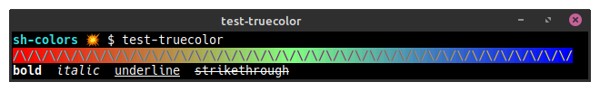

# `sh-colors`

POSIX-compliant ANSI color and attribute injectors for the shell.

*Spice up your command line!*

Jump ahead for [installation](#installation) help,
keeping reading for a little introduction,
or refer to the [API](#api).

## Usage

Source the `bin/colors.sh` library to expose a collection of
[VT100](https://vt100.net/) terminal
[ANSI escape code](https://en.wikipedia.org/wiki/ANSI_escape_code)
injectors (functions)
for adjusting
[display attributes](https://en.wikipedia.org/wiki/ANSI_escape_code#SGR_parameters)
(such as *bold* and *italic*),
and for changing terminal colors
(using popularly-named and palette-proof
[RGB "true color"](https://en.wikipedia.org/wiki/ANSI_escape_code#24-bit)
values).

I.e., this library defines functions you (or your code) can call
from within `echo` and `printf`.

To get started, source the library file in your shell,
and then call its functions to adorn text.

E.g.,

  ```shell
  $ . colors.sh
  $ echo "$(fg_pink)$(bg_darkgray)Hello, $(attr_italic)World!$(attr_reset)"
  ```

### Terminal-sensing enablement

*The library will disable itself (output nothing) unless `[ -t 0 ] && [ -t 1 ]`
is truthy when the library is sourced.*

Specifically, if you source `colors.sh` on shell startup (e.g., from
`~/.bashrc`), it will be enabled throughout the user session.

On the other hand, when `colors.sh` is sourced from another shell
script, whether or not it's enabled depends on whether the shell script
itself is connected to a terminal.

- If you'd like to force the script to use color (or not), set
  `SHCOLORS_OFF=false` (or `SHCOLORS_OFF=true`).

For instance, the script will self-enable if you source it from a user session:

  ```shell
  $ unset SHCOLORS_OFF
  $ . colors.sh
  $ echo $SHCOLORS_OFF
  false
  ```

But if you source the library from an executable and then redirect that output
(or the input), the script will not sense a terminal and will self-disable, e.g.,

  ```shell
  $ cat <<'EOF' >test-shcolors_off
    . colors.sh
    echo "SHCOLORS_OFF is $SHCOLORS_OFF"
  EOF

  $ bash test-shcolors_off
  SHCOLORS_OFF is false

  $ bash test-shcolors_off | cat
  SHCOLORS_OFF is true

  $ >&2 echo "A pipeline!" | bash test-shcolors_off
  A pipeline!
  SHCOLORS_OFF is true
  ```

## Installation

The author recommends cloning the repository and wiring its `bin/` to `PATH`.

You can also create a symlink to the library (`colors.sh`) from a location
already on `PATH`, such as `~/.local/bin`.

Or you could clone the project and load the library to evaluate it first,
before deciding how you want to wire it.

Alternatively, you might find that using a shell package manager, such as
[`bkpg`](https://github.com/bpkg/bpkg),
is more appropriate for your needs, e.g.,
`bpkg install -g landonb/sh-colors`.

### Makefile install

The included `Makefile` can also be used to help install.

- E.g., you could clone this project somewhere and
  then run a `sudo make install` to install it globally:

  ```shell
  git clone https://github.com/landonb/sh-colors.git
  cd sh-colors
  # Install to /usr/local/bin
  sudo make install
  ```

- Specify a `PREFIX` to install anywhere else, such as locally, , e.g.,

  ```shell
  # Install to $USER/.local/bin
  PREFIX=~/.local/bin make install
  ```

  And then ensure that the target directory is on the user's `PATH` variable.

  You could, for example, add the following to `~/.bashrc`:

  ```shell
  export PATH=$PATH:$HOME/.local/bin
  ```

### Manual install

If you clone the project and want the library functions to be
loaded in your shell, remember to ensure that it can be found
on `PATH`, and then source the library file, e.g.,

  ```shell
  git clone https://github.com/landonb/sh-colors.git
  export PATH=$PATH:/path/to/sh-colors/bin
  . colors.sh
  ```

## API

After installing the `colors.sh` script, and ensuring
that `PATH` is configured correctly, you can easily load it
from any directory by sourcing it:

  ```shell
  . colors.sh
  ```

Look inside the `colors.sh` source code for the list of attribute
functions and color functions that are available.

You can also run `test-colors` to see an example of the colors.

### `test-colors`

Run `test-colors` to see the list of color functions.

  ```shell
  $ test-colors
  ```


Note that there are a handful of so-called "true color" color functions,
as well as a handful of 256-color palette functions. You might notice that some
of the 256-palette colors do not appear as expected, e.g., `fg_black`
might look dark gray, not black. This may happen because some terminal
emulator (such as `gnome-terminal`, and `mate-terminal`) will map
certain color codes to their own color palette (that you should be able
to configure, but it might be easier to use only the true color functions
for better portability).

### `strip-colors`

Use strip-colors to remove control codes from an input stream, e.g.,:

  ```shell
  $ echo "$(fg_green)I'm not green!$(attr_reset)" | strip-colors
  I'm not green!
  ```


### `test-truecolor`

Use `test-truecolor` to verify that your terminal supports 24-bit so-called "true colors".

  ```shell
  $ test-truecolor
  ```

You should see something like:



Enjoy!

